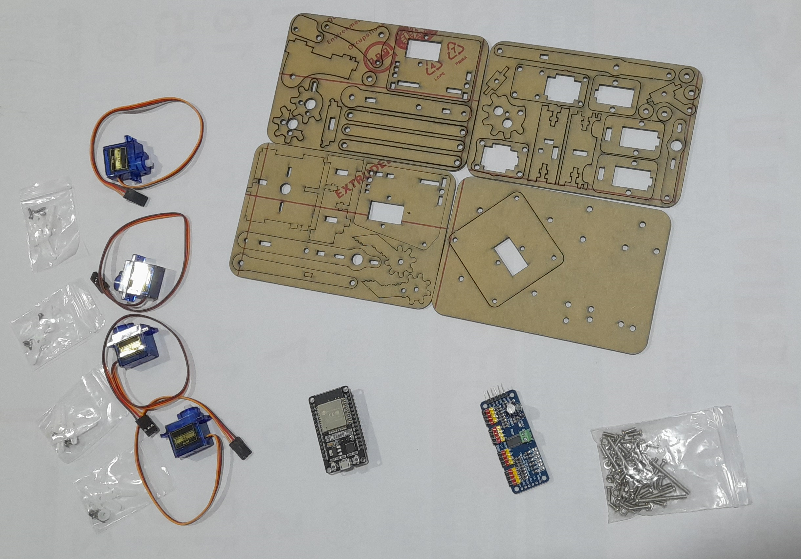
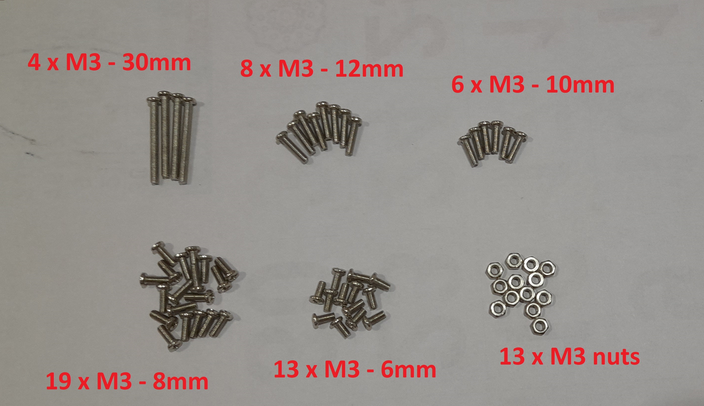

# 4-DOF MeArm Robot

Building and programming a 4 degree of freedom robotic arm (MeArm Robot Kit)

## Hardware

List of hardware (with links)

1. [ESP32](https://www.duino.lk/ESP32-Wireless-WiFi-Bluetooth-2.4GHz-CP2102?search=esp32&category_id=0)
2. [4-DOF Robot Arm DIY Acrylic Kit](https://www.duino.lk/DIY-Acrylic-Robot-Arm-Kit-4DOF?search=4dof&category_id=0)
3. [PCA9685 Servo Motor Driver](https://www.duino.lk/Servo-Motor-Driver-16-Channel-12-bit-PWM-I2C?search=servo%20driv&category_id=0)
4. [9G Micro Servo Motor x 4](https://www.duino.lk/Servo-Motor-SG90-9G?search=Servo%20motor&category_id=0)

The following fasteners are included in the MeArm Robot kit :
1. 4pcs x M3 - 30mm
2. 8pcs x M3 - 12mm
3. 6pcs x M3 - 10m
4. 19pcs x M3 - 8mm
5. 13pcs x M3 - 6mm
6. 13pcs x M3 hex nuts

## Calibrating Servo Motors

### Servo Motor Pinout

- Brown : Ground
- Red : +5V Supply
- Orange : Signal (PWM)

The servo motor position changes from $0^0$ to $180^0$ depending on the duty cycle of the PWM signal given to the Orange wire.

The duty cycle corresponding to minimum and maximum position must be found during the calibration process.

### PCA9685 Driver

Connect the Motor driver module to the ESP32 for testing. Tutorial for connecting the module to an Arduino is given [here](https://learn.adafruit.com/16-channel-pwm-servo-driver/hooking-it-up)

Connect the Module to the ESP32 as follows

| ESP32 Pin   | Module Pin |
| ----------- | -----------|
| 3V3 | VCC |
| GND | GND |
| D22 | SCL |
| D21 | SDA |

The power for the servo motors must be given through an external power source to the V+ and GND terminals. Connect this to a 5V power source capable of sourcing ~2A current

### Calibration process

The duty cycle corresponding to minimum and maximum servo positions was found using an analog potentiometer with the ["servo_test"](./servo_test/servo_test.ino) code.

Servos were set to the required position using the ["servo_calib"](./servo_calib/servo_calib.ino) code.

## Assembly Process

Several assembly tutorials available online. This kit differs slightly from most other commonly avaliable kits. Some linkages are missing. [This](https://www.youtube.com/watch?v=-H-A9VDSot4) is a video tutorial for this exact kit.

## Dimensions

Accurate measurements of the dimensions are essential for proper calculation of inverse and forward kinematics.

The dimensions of the kit used in the this project are given below.

| Paramter | Value (mm) |
|:-------:|:---------:|
| $l_0$ | 0 |
| $h_1$ | 64 |
| $l_1$ | 15 |
| $l_2$ | 80 |
| $l_3$ | 80 |
|$l_{3I}$| 35 |
|$l_{3O}$| 35 |
| $l_4$ | 80 |
| $l_5$ | 65 |
| $d_5$ | 5 |

Before calculating configurations using inverse kinematics, the angles of the servo motors must be verified.
This can be done by setting all servos to $90^0$ and checking with the given diagram above.